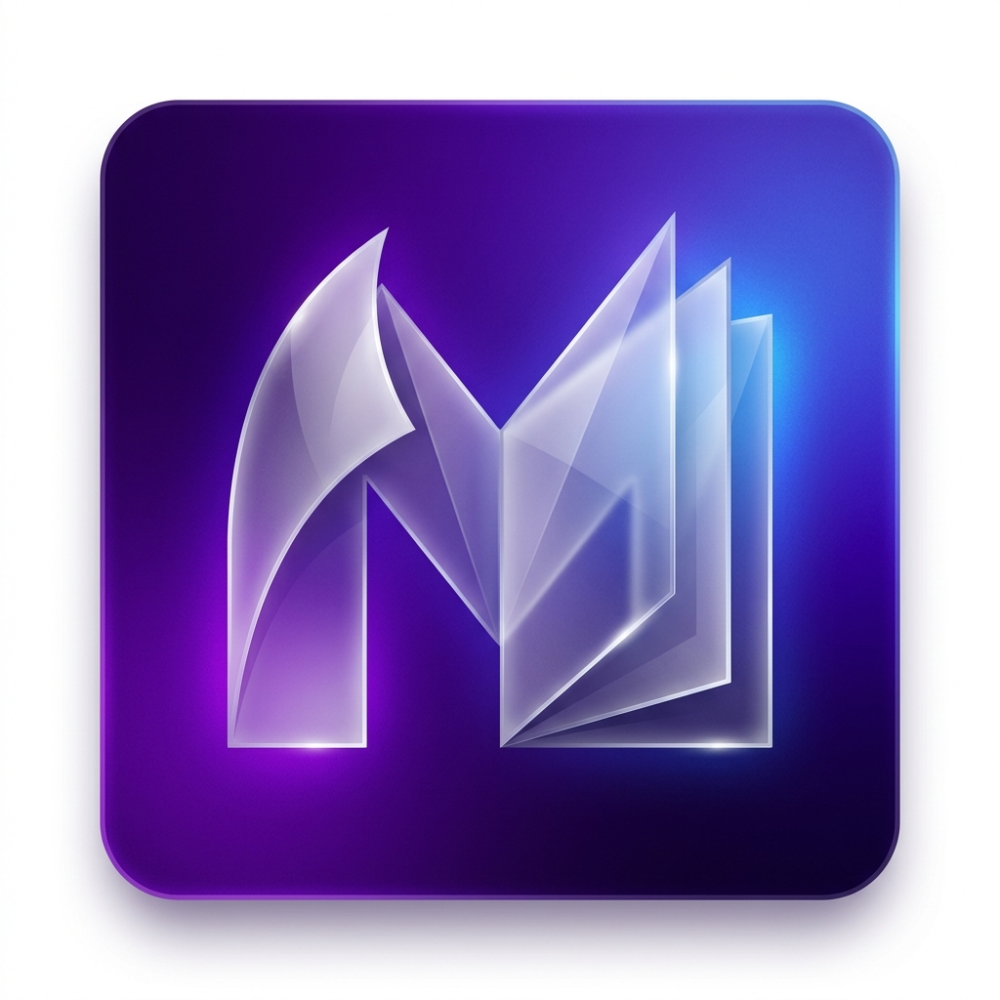

# MiloDex

<p align="center">
  
</p>

<p align="center">
  <strong>Leitor moderno de mangas, comics e livros com integracao MangaDex, biblioteca local e uma experiencia de leitura feita para desktop e Android.</strong>
</p>

<p align="center">
  <a href="https://github.com/MiloRuback/MiloDex/releases/latest">
    
  </a>
  <a href="https://github.com/MiloRuback/MiloDex/actions/workflows/release.yml">
    
  </a>
  
</p>

<p align="center">
  <a href="https://github.com/MiloRuback/MiloDex/releases/latest/download/MiloDex-Setup-1.0.0.exe">
    
  </a>
  <a href="https://github.com/MiloRuback/MiloDex/releases/latest/download/MiloDex-Android-1.0.0-debug.apk">
    
  </a>
  <a href="https://github.com/MiloRuback/MiloDex/releases/latest/download/MiloDex-1.0.0.AppImage">
    
  </a>
  <a href="https://github.com/MiloRuback/MiloDex/releases/latest/download/MiloDex-1.0.0-arm64.dmg">
    
  </a>
</p>

## Sobre

MiloDex e um leitor para quem quer buscar mangas no MangaDex, organizar uma biblioteca propria e continuar lendo sem brigar com a interface. Ele nasceu como app desktop em Electron e agora tambem gera APK Android via Capacitor.

O leitor suporta modos RTL, LTR e rolagem vertical, guarda progresso automaticamente, permite zoom/pan, baixa capitulos do MangaDex em CBZ e oferece selecao de idioma/versao dos capitulos quando houver mais de uma opcao no MangaDex.

## Downloads

Os botoes acima apontam para os arquivos da ultima release publicada no GitHub.

| Plataforma | Arquivo da release | Observacao |
| --- | --- | --- |
| Windows | `MiloDex-Setup-1.0.0.exe` | Instalador NSIS x64 |
| Android | `MiloDex-Android-1.0.0-debug.apk` | APK instalavel por sideload |
| Linux | `MiloDex-1.0.0.AppImage` / `MiloDex-1.0.0.deb` | AppImage e pacote Debian |
| macOS | `MiloDex-1.0.0-x64.dmg` / `MiloDex-1.0.0-arm64.dmg` | Builds Intel e Apple Silicon |

> O APK atual e assinado com chave debug. Em celulares Samsung/Android, pode ser necessario permitir instalacao de apps de fonte externa.

## Recursos

- Busca, detalhes e capitulos direto pela API do MangaDex.
- Filtro de idioma e lista de versoes/grupos disponiveis para cada manga.
- Reader com pagina unica, pagina dupla, RTL, LTR e rolagem vertical.
- Zoom com Ctrl + scroll no desktop e pinch-to-zoom no Android.
- Toque central no Android para esconder/mostrar a interface do reader.
- Historico de leitura com pagina, capitulo, zoom e modo de leitura.
- Biblioteca local com status de leitura.
- Download de capitulos MangaDex em CBZ.
- Tema escuro com layout responsivo para desktop e celular.

## Suporte de arquivos locais

| Plataforma | Suporte atual |
| --- | --- |
| Desktop | CBZ, CBR limitado, TXT, HTML, DOCX/DOC; PDF/EPUB ainda estao em desenvolvimento no reader |
| Android | CBZ, TXT e HTML |

Para mangas online, o fluxo principal recomendado e usar a busca do MangaDex dentro do app.

## Stack

| Camada | Tecnologia |
| --- | --- |
| Desktop | Electron 31 + electron-vite |
| Mobile | Capacitor + Android WebView |
| Frontend | React 18 + TypeScript |
| Estado | Zustand |
| Estilo | Tailwind CSS + CSS responsivo |
| Arquivos | JSZip, Mammoth, parsers locais |
| API | MangaDex REST API |
| Build | electron-builder + Gradle |

## Desenvolvimento

```bash
npm install
npm run dev
```

Requer Node.js 22+.

## Builds locais

```bash
# Windows
npm run build:win

# Android APK
npm run mobile:apk

# Linux
npm run build:linux

# macOS
npm run build:mac
```

O APK local e copiado para:

```text
dist/android/MiloDex-debug.apk
dist/android/MiloDex-Android-1.0.0-debug.apk
```

## Publicar uma release

O repositorio inclui um workflow em `.github/workflows/release.yml`. Para publicar instaladores no GitHub:

```bash
git tag v1.0.0
git push origin main --tags
```

O workflow gera os assets de Windows, Android, Linux e macOS e publica tudo na pagina de Releases.

Se quiser publicar manualmente os assets Windows/Android ja gerados nesta maquina:

```powershell
$env:GITHUB_TOKEN = 'seu_token_com_contents_write'
npm run build:win
npm run mobile:apk
powershell -ExecutionPolicy Bypass -File scripts/publish-github-release.ps1
```

## Estrutura

```text
MiloDex/
|-- android/                 # Projeto Android gerado pelo Capacitor
|-- resources/               # Icones e assets do app
|-- scripts/                 # Scripts auxiliares de build
|-- src/
|   |-- main/                # Processo principal do Electron
|   |-- preload/             # Bridge segura para o renderer
|   `-- renderer/            # App React
|       |-- components/
|       |-- mobile/
|       |-- pages/
|       |-- store/
|       |-- types/
|       `-- utils/
`-- electron-builder.yml     # Configuracao dos instaladores desktop
```

## Licenca

MIT. Projeto mantido por MiloDev.
